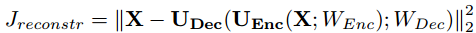
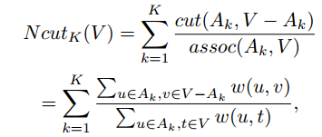

# W-Net
W-Net: A Deep Model for Fully Unsupervised Image Segmentation

## Tensorflow Implementation of W-Net 


> Both the loss functions `Soft-N-Cut-Loss` and `Reconstruction Loss` has been Implemented

> Batch Processing is enabled

> As this model is unsupervised, we will be needing a huge amount of dataset to train properly.


To start the training, run

```bash
python soft_n_cut_loss.py
```

For tensorboard visualizations, 

```bash
cd checkpoints/logs
tensorboard --logdir=.
```
## Loss Description





## Pipeline of Tasks

- [x] Encoder Decoder Architecture
- [x] Reconstruction Loss
- [x] Soft N Cut Loss
- [x] Batch Processing
- [ ] Post Processing
    - [ ] Heirarchical Segmentation
    - [ ] Conditional Random Fields
